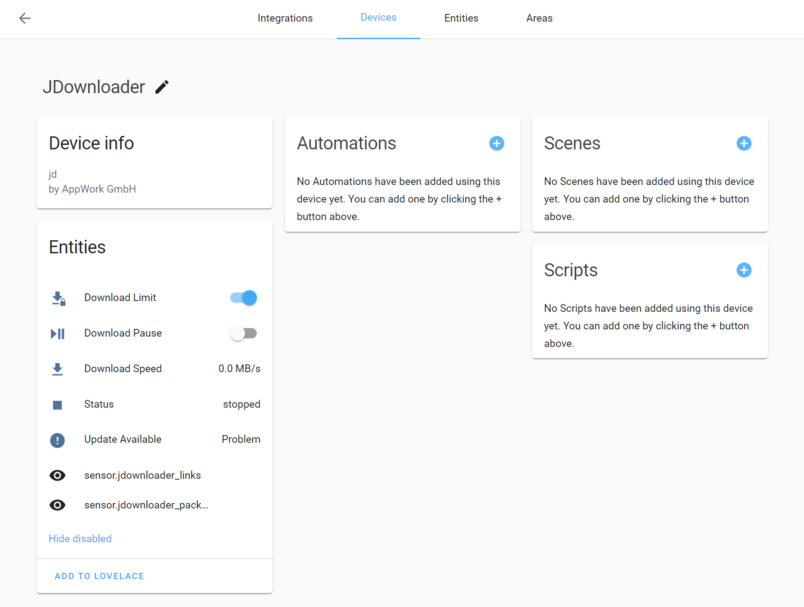

# MyJDownloader Integration for Home Assistant

**This is still beta! Feedback, bug reports and contributions welcome!**

## Configuration

Add this repository to HACS, install this integration and restart Home Assistant. Adding MyJDownloader to your Home Assistant instance can be done via the user interface, by using this My button:

  
Manual configuration steps

- Browse to your Home Assistant instance.
- In the sidebar click on [Configuration](https://my.home-assistant.io/redirect/config).
- From the configuration menu select: [Integrations](https://my.home-assistant.io/redirect/integrations).
- In the bottom right, click on the [Add Integration](https://my.home-assistant.io/redirect/config_flow_start/?domain=myjdownloader) button.
- From the list, search and select "MyJDownloader".
- Follow the instruction on screen to complete the set up.

**Note:** Do not disable the `sensor.jdownloaders_online` entity, as it is responsible for checking for new JDownloaders which become online.

## Features

**Sensor**

- status
- number of links
- number of packages

Note: number of links/packages sensors contain state attributes that have information on ETA while downloading.

**Binary Sensor**

- update available (deprecated, use designated update entity)

**Update**

- update to latest version

**Switch**

- pause downloads
- limit download speed

**Service**

- `myjdownloader.run_update_check`
- `myjdownloader.restart_and_update`
- `myjdownloader.start_downloads`
- `myjdownloader.stop_downloads`
- `myjdownloader.add_links`

Note: Only select a single _entity_ (e.g., the *_status entity) from the JDownloader when calling a service, not the JDownloader _device_.

## Known Issues

- [ ] When using the pause switch, it might take a while for the status sensor to reflect the new pause state.
- [ ] There is not much error handling yet, e.g. when you change your password, you need to remove and add the integration again.
- [ ] Selecting a JDownloader device for a service target will call that service as many times as there are enabled entities for that device. This integration probably needs to be refactored in a way, that this is avoided e.g., with a designated `myjdownloader.*` entity.
