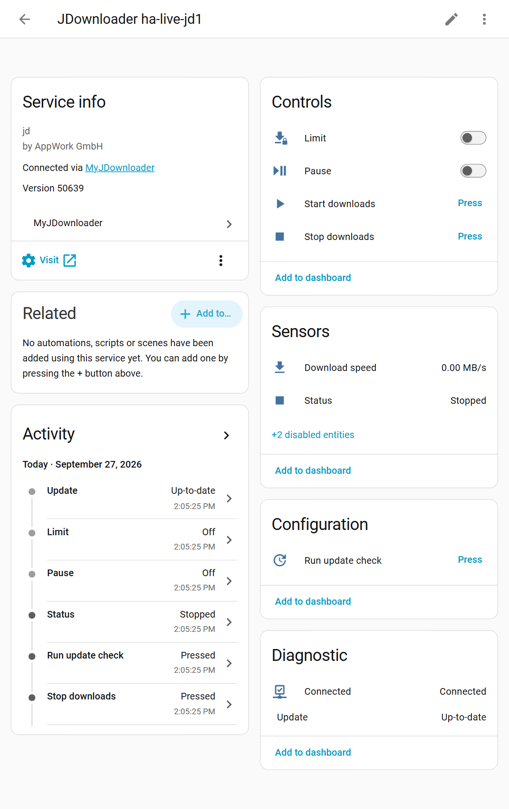

# MyJDownloader Integration for Home Assistant


[](https://github.com/hacs/integration)

Monitor and control your [JDownloader](https://jdownloader.org/) instances from Home Assistant through
[MyJDownloader](https://my.jdownloader.org/), the remote access service of JDownloader. See what your
JDownloaders are doing, pause or start downloads, limit the download speed, add links from automations
and install JDownloader updates.



## Requirements

- Home Assistant 2026.8 or newer.
- A free [MyJDownloader account](https://my.jdownloader.org/login.html#register).
- One or more JDownloader 2 instances connected to that account (in JDownloader: Settings → MyJDownloader).
  Desktop, headless and Docker installations are supported.

## Installation

The integration is available in the default [HACS](https://hacs.xyz/) store:

1. In Home Assistant, open HACS and search for **MyJDownloader**.
2. Download it and restart Home Assistant.

<details>
  <summary>Manual installation</summary>

Copy the folder `custom_components/myjdownloader` of the latest
[release](https://github.com/doudz/homeassistant-myjdownloader/releases) into the `custom_components`
folder of your Home Assistant configuration and restart Home Assistant.
</details>

## Configuration

[](https://my.home-assistant.io/redirect/config_flow_start/?domain=myjdownloader)

Or go to **Settings → Devices & services → Add integration** and select **MyJDownloader**.

| Parameter | Description |
|---|---|
| Email | The email address of your MyJDownloader account. |
| Password | The password of your MyJDownloader account. |

Every JDownloader connected to the account appears as a device. Several MyJDownloader accounts can be
added as separate entries.

When you change the password of your MyJDownloader account, Home Assistant asks you to re-authenticate.
To change the credentials yourself, use **Reconfigure** in the menu of the integration entry.
The integration has no further options.

## Removal

1. Go to **Settings → Devices & services → MyJDownloader**, open the menu of the entry and select **Delete**.
2. To remove the code, uninstall **MyJDownloader** in HACS (or delete `custom_components/myjdownloader`)
   and restart Home Assistant.

Removing the integration does not change anything in JDownloader or your MyJDownloader account.

## Entities

Each JDownloader provides:

| Entity | Type | Description | Enabled by default |
|---|---|---|---|
| Status | Sensor | `idle`, `running`, `paused`, `stopping` or `stopped` | Yes |
| Download speed | Sensor | Current download speed in MB/s | Yes |
| Packages | Sensor | Number of packages in the download list; attribute `packages` lists them | No |
| Links | Sensor | Number of links in the download list; attribute `links` lists them | No |
| Pause | Switch | Pauses and resumes the running downloads | Yes |
| Limit | Switch | Turns the download speed limit configured in JDownloader on or off | Yes |
| Start downloads / Stop downloads | Button | Starts or stops downloading | Yes |
| Run update check | Button | Lets JDownloader check for updates | Yes |
| Update | Update | Shows whether a JDownloader update is available and installs it (restarts JDownloader) | Yes |
| Connected | Binary sensor | Whether the JDownloader is connected to MyJDownloader | Yes |

The account device provides the sensor **JDownloaders online** with the number of connected JDownloaders
and their names as attributes.

The package and link lists include ETA and progress while downloading. They do not contain download
passwords, URLs, comments or download folders, since attributes are visible to every user. They can be
large, so they are not stored in the recorder history.

## Actions

### `myjdownloader.add_links`

Adds links to the LinkGrabber of a JDownloader.

| Field | Required | Description |
|---|---|---|
| `device_id` | Yes | The JDownloader. |
| `links` | Yes | One or more links: http(s), magnet, ftp, container links, or text containing links. |
| `priority` | No | `highest`, `higher`, `high`, `default` (default), `low`, `lower`, `lowest`. |
| `package_name` | No | Name of the package. |
| `autostart` | No | Start downloading right after adding. Default `false`. |
| `auto_extract` | No | Extract downloaded archives. Default `false`. |
| `extract_password` | No | Password for archive extraction. |
| `download_password` | No | Password for the links. |
| `destination_folder` | No | Download folder on the JDownloader machine. |
| `overwrite_packagizer_rules` | No | Let these settings override JDownloader's packagizer rules. Default `false`. |

### Deprecated actions

`myjdownloader.start_downloads`, `stop_downloads`, `run_update_check` and `restart_and_update` are
deprecated since 3.0 and will be removed in 3.2. Use the buttons and the install action of the update
entity instead. Targeting entities (`entity_id`) instead of a JDownloader (`device_id`) is deprecated
as well. Home Assistant shows a repair issue when either is used.

## Examples

Add a link shared with a script, and start downloading right away:

```yaml
action: myjdownloader.add_links
data:
  device_id: 0123456789abcdef0123456789abcdef
  links:
    - https://example.com/file.zip
  package_name: From Home Assistant
  autostart: true
```

Pause downloads while the TV is streaming, and resume afterwards:

```yaml
triggers:
  - trigger: state
    entity_id: media_player.living_room_tv
    to: playing
    id: streaming
  - trigger: state
    entity_id: media_player.living_room_tv
    from: playing
    id: done
actions:
  - action: "switch.turn_{{ 'on' if trigger.id == 'streaming' else 'off' }}"
    target:
      entity_id: switch.jdownloader_mypc_pause
```

Get notified when all downloads have finished:

```yaml
triggers:
  - trigger: state
    entity_id: sensor.jdownloader_mypc_status
    from: running
    to: idle
actions:
  - action: notify.mobile_app_phone
    data:
      message: JDownloader has finished downloading.
```

Other ideas: turn on the speed limit during working hours, or install JDownloader updates at night.

## How data is updated

- The integration polls MyJDownloader every 60 seconds. JDownloader does not push changes.
- MyJDownloader requires requests of one account to be sent one after the other, so all JDownloaders of
  an account are updated in one sequence.
- If Home Assistant and a JDownloader are in the same network, the requests go to the JDownloader
  directly (encrypted) instead of through the MyJDownloader servers.
- Package and link lists are only requested while their sensors are enabled.
- The latest JDownloader revision shown by the update entity is checked once a day.
- After an action (switch, button, update), the state is refreshed right away.

## Known limitations

- MyJDownloader only lists JDownloaders that are currently connected. A JDownloader that is switched off
  and one that was removed from the account look the same: its entities become unavailable and
  **Connected** turns off. You can delete such a device in its device page while it is offline;
  it is added again automatically when it connects again.
- All requests of an account are sent one after the other, so many JDownloaders on one account make each
  update take longer.
- The update entity relies on JDownloader's own update check. The version shown is JDownloader's core
  revision; when JDownloader reports an update and the latest revision cannot be determined, the latest
  version is shown as the installed revision followed by `+`.
- The integration depends on the MyJDownloader service. When it is down, all entities are unavailable.
- Version 3.0 migrates the configuration. Going back to 2.x is only possible by restoring a Home Assistant
  backup made before the update; otherwise 2.x cannot load the migrated entry.

## Troubleshooting

- **A JDownloader does not show up:** check in JDownloader under Settings → MyJDownloader that it is
  connected with the same account. It shows up within a minute after connecting.
- **Entities are unavailable:** the JDownloader is not connected to MyJDownloader, or MyJDownloader is
  not reachable. The **Connected** binary sensor shows which of the two applies.
- **"Authentication expired" in Home Assistant:** the account password changed. Select the notification
  and enter the new password.
- **Anything else:** enable debug logging in the integration entry menu (**Enable debug logging**),
  reproduce the problem, and attach the log and the diagnostics (**Download diagnostics**) to an
  [issue](https://github.com/doudz/homeassistant-myjdownloader/issues). Credentials are removed from
  the diagnostics. Equivalent `configuration.yaml`:

  ```yaml
  logger:
    logs:
      custom_components.myjdownloader: debug
      myjdapi: debug
  ```

## Development

Home Assistant does not run on Windows, so tests run in a Linux container
(Docker required; plain `pytest` works on Linux/macOS after
`pip install -r requirements_test.txt`):

```bash
scripts/test          # ruff, formatting and pytest against the latest supported Home Assistant
scripts/test --min    # tests against the minimum supported Home Assistant (2026.8)
scripts/test mypy     # any command inside the test container
```

A live environment with Home Assistant and headless JDownloaders is in `live/`;
copy `live/.env.example` to `live/.env` and use a dedicated MyJDownloader test account:

```bash
docker compose -f live/docker-compose.yml up -d
```
